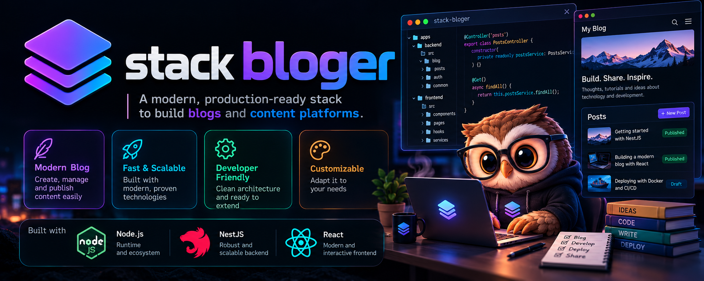

# Bloger — Blog CMS

<p align="center">
  
</p>

Bloger is a content management system and public blog built with React, NestJS, and PostgreSQL. It includes editorial workflows, scheduled publishing, comments and reactions, and a scoped external API.

## Table of contents

- [Features](#features)
- [Tech stack](#tech-stack)
- [Architecture](#architecture)
- [Requirements](#requirements)
- [Docker setup](#docker-setup)
- [Configuration](#configuration)
- [Local development without Docker](#local-development-without-docker)
- [API](#api)
- [External API clients](#external-api-clients)
- [Security](#security)
- [Testing and code quality](#testing-and-code-quality)
- [Database migrations](#database-migrations)
- [Repository structure](#repository-structure)
- [Known limitations](#known-limitations)

## Features

### Public blog and reading experience

- Paginated published-article feed with full-text search, sorting by newest/oldest/popular, and category/tag filters in the API.
- Card and horizontal layouts, debounced search, actionable empty state, and `⌘K` / `Ctrl+K` search shortcut.
- Article pages with Open Graph metadata, JSON-LD, estimated reading time, reading progress, and related articles.
- RSS feed at `/feed.xml` and sitemap at `/sitemap.xml`.
- HTML sanitization when rendering article content.

### Editorial administration

- Create, edit, schedule, publish, archive, and delete articles.
- Manage categories, tags, users, roles, and permissions.
- Upload images and select featured images.
- Local draft autosave in the article creation form.
- Dashboard with recent and most-read articles.

### Community

- Article reactions, view counts, and authenticated per-user bookmarks.
- Comments linked to their author and article. New comments are pending by default and are hidden from public listings until approved.

## Tech stack

| Area | Technologies |
| --- | --- |
| Frontend | React 19, TypeScript 7, Vite 8, Tailwind CSS 4, React Router, TanStack Query, and Tiptap |
| Backend | Node.js 22, NestJS 12, TypeORM, and PostgreSQL 16 |
| Rate limiting | Redis 7 and `@nestjs/throttler` |
| Proxy / production | Nginx and Docker Compose |
| Package manager | pnpm 12.4.2 |

Resolved dependency versions are recorded in `frontend/pnpm-lock.yaml` and `backend/pnpm-lock.yaml`.

## Architecture

The backend is organized into layers:

- `backend/src/domain`: entities, exceptions, and repository contracts.
- `backend/src/application`: use cases and DTOs.
- `backend/src/infrastructure`: Nest controllers, TypeORM persistence, authentication, and external services.

The frontend uses page modules, loaders, API services, shared components, and React Query. Reads and writes are separated through use cases, but the project does **not** implement full CQRS with independent read models.

## Requirements

- Docker and Docker Compose for the full stack.
- For local development: Node.js 22 and pnpm 12.4.2.
- Chromium installed through Playwright to run frontend E2E tests.

## Docker setup

1. Copy the environment template:

   ```sh
   cp .env.example .env
   ```

2. Update PostgreSQL, JWT, and port values in `.env` as needed. Do not use example credentials in a real deployment.

3. Start the development stack:

   ```sh
   docker compose -f compose.yml -f compose.dev.yml up -d --build
   ```

   Vite HMR is enabled. PostgreSQL and Redis run on the internal Docker network. Open `http://localhost:${NGINX_PORT}`; the default is `NGINX_PORT=8080`.

4. Start the local production stack:

   ```sh
   docker compose up -d --build
   ```

   The frontend is built and served as static assets. The backend applies pending migrations before starting Nest. Nginx publishes the port configured by `NGINX_PORT`.

Useful development commands:

```sh
make help
make ps
make logs
make logs-backend
make logs-frontend
```

## Configuration

The complete template is `.env.example`. Main variables:

| Variable | Purpose |
| --- | --- |
| `POSTGRES_DB`, `POSTGRES_USER`, `POSTGRES_PASSWORD` | PostgreSQL initialization |
| `DB_HOST`, `DB_PORT`, `DB_NAME`, `DB_USER`, `DB_PASSWORD` | Backend PostgreSQL connection |
| `JWT_SECRET` | Web session signing key; must be at least 32 bytes |
| `API_CLIENT_JWT_SECRET` | Optional separate signing key for integration tokens. If omitted, it is cryptographically derived from `JWT_SECRET` using a separate context label |
| `JWT_EXPIRES_IN_SECONDS` | Web access-token lifetime |
| `JWT_REFRESH_TTL_MINUTES` | Refresh-token lifetime |
| `REDIS_URL` | Shared Redis rate-limit storage; Compose defaults to `redis://redis:6379` |
| `FRONTEND_URL` | Allowed frontend origin for CORS and CSRF checks |
| `NGINX_PORT` | Published HTTP port |
| `VITE_BACKEND_URL`, `VITE_PUBLIC_API_URL` | Vite API/proxy configuration |

The backend exits at startup if `JWT_SECRET` is missing or shorter than 32 bytes.

## Local development without Docker

The backend requires reachable PostgreSQL and Redis services. In separate terminals:

```sh
# Backend
cd backend
pnpm install
pnpm dev
```

```sh
# Frontend
cd frontend
pnpm install
pnpm dev
```

Configure `backend/.env` with `DB_*`, `JWT_SECRET`, `FRONTEND_URL`, and `REDIS_URL`. Set `VITE_BACKEND_URL` to match the backend address used by Vite.

## API

All API routes are versioned under `/api/v1`.

### Internal API

- Session: `/api/v1/auth/login`, `/api/v1/auth/refresh`, `/api/v1/auth/logout`, `/api/v1/auth/me`.
- Administration: `/api/v1/posts`, `/api/v1/users`, `/api/v1/categories`, `/api/v1/tags`, and settings resources.
- Public blog: `/api/v1/public/posts`, `/api/v1/public/categories`, `/api/v1/public/tags`.
- Engagement: comments, reactions, bookmarks, and view counts under `/api/v1/public/posts/:slug/...`.

Browser sessions use `HttpOnly` cookies. Tokens are not returned in the login JSON response or stored in `localStorage`.

### OpenAPI documentation

Swagger is available at `/api/docs` in development. It is disabled in production unless explicitly enabled with `SWAGGER_ENABLED=true`.

## External API clients

Administrators can create and revoke clients in **Users → API clients**. A client secret is shown only once and stored as a hash. Clients exchange credentials for a 15-minute `client_credentials` Bearer token.

Available scopes:

- `posts:read`
- `categories:read`
- `tags:read`

Protected resources are `/api/v1/integrations/posts`, `/categories`, and `/tags`. See [`backend/API_CLIENTS.md`](backend/API_CLIENTS.md) for complete `curl` examples.

## Security

- Web session cookies are `HttpOnly`, `SameSite=Lax`, and `Secure` in production.
- Mutating cookie-authenticated requests, including login, validate `Origin`/`Referer` to mitigate CSRF.
- Refresh tokens are random, stored hashed, rotated atomically, and protected against reuse.
- Internal APIs use role checks. External clients use a separate signing key/context, `issuer`, `audience`, short token lifetime, and explicit scopes.
- Rate limits use shared Redis storage. Nginx forwards client IP information and Express trusts only the configured proxy hop.
- Internal error details are not exposed in HTTP 500 responses.
- Avatar and image uploads have size limits and signature validation.
- Existing wildcard-scoped API clients are revoked by migration; newly created clients must have explicit scopes.

Default rate limits are 100 requests per minute; login is limited to 5 per minute, token issuance to 10 per minute, uploads to 20 per hour, and integration resources to 120 per minute.

## Testing and code quality

### Backend

```sh
cd backend
pnpm tsc
pnpm lint
pnpm test
```

Tests cover scheduled publishing, login cookies, OAuth client credentials, scopes, CSRF, refresh-token rotation, and rate limiting. The Redis test is skipped unless `REDIS_TEST_URL` is set.

Run the full backend suite against Redis in the Docker development stack:

```sh
docker compose -f compose.yml -f compose.dev.yml exec \
  -e REDIS_TEST_URL=redis://redis:6379 backend pnpm test
```

### Frontend

```sh
cd frontend
pnpm tsc
pnpm lint
pnpm build
pnpm exec playwright install chromium
pnpm test:e2e
```

Playwright E2E tests use API fixtures, so they do not require database content or real credentials. They cover search, view modes, pagination, and article details. See [`frontend/E2E.md`](frontend/E2E.md) for more information.

### Dependency audits

```sh
(cd backend && pnpm audit --prod)
(cd frontend && pnpm audit --prod)
```

## Database migrations

TypeORM migrations are in `backend/src/infrastructure/database/migrations/`.

- In production, the backend container runs pending migrations before starting the API.
- In development, TypeORM synchronization is enabled; manual migration commands are also available through `make migration-run`.

Generate a migration in development with:

```sh
make migration-generate NAME=DescriptiveName
```

## Repository structure

```text
backend/          NestJS API, domain, use cases, persistence, and migrations
frontend/         React app, blog, administration, and Playwright E2E tests
infrastructure/   Dockerfiles and Nginx configuration
compose.yml       Local production stack
compose.dev.yml   Vite/Nest development overrides
Makefile          Compose, log, and migration shortcuts
docs/             Project artwork and documentation assets
```

## Known limitations

- New comments are held pending approval, but a full admin interface to approve/reject them is not yet available.
- Article bookmarks can be toggled, but there is no user page listing saved articles yet.
- Compose uses standalone Redis. Production deployments requiring high availability should use a managed Redis service or HA topology.
- Current E2E tests cover the main public blog flows; the full admin panel is not yet covered end-to-end.
